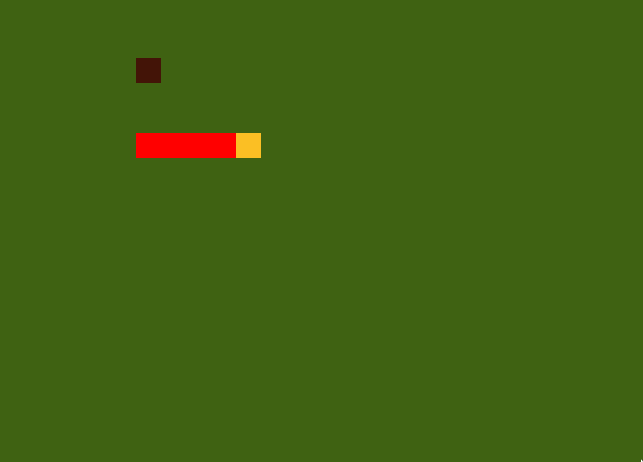

# snake-game
A classic Snake game implemented in C, using the Raylib library for graphics



## Features

- **Snake Movement:** Control the snake using arrow keys.
- **Food:** Randomly generated food items to increase snake length.
- **Collision Detection:** Snake dies if it collides with its own body or the screen edges.

## Prerequisites

- **Raylib Library:** Install the Raylib library for graphics and input handling.
- **GCC:** Compiler to build the game from source.

## Installation

- **Clone Repository:**
   ```bash
   git clone https://github.com/rtheimer/snake-game.git
   cd snake-game
   make
   ./snake
   ```

## License
This project is licensed under the MIT License - see the LICENSE file for details.

## To-Dos
### Score and Level System

- **Implement Score Tracking:** Adding functionality to keep track of the player's score as the snake eats food.
- **Level Progression:** Creating a level system where the game gets progressively harder as the score increases.

### Pixel Art

- **Snake Graphics:** Enhance the visual representation of the snake using pixel art or low-resolution graphics.
- **Playground Design:** Design the game playground with pixel art to give it a nostalgic feel.

